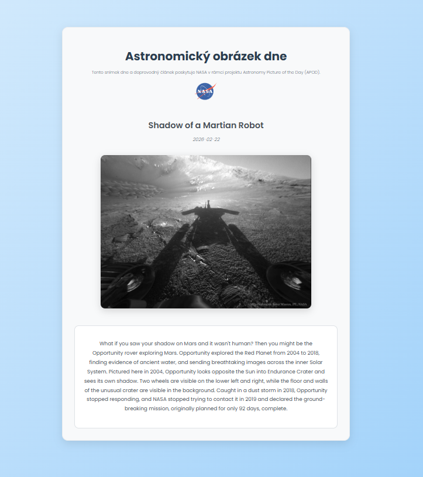

# 🚀 NASA Astronomy Picture of the Day App

This project uses the official **NASA API**, specifically the **Astronomy Picture of the Day (APOD)** service.  
The API provides a daily astronomy image along with a detailed explanation written by professional astronomers.

The NASA API is free to use with a personal API key.

---

## 🌌 About the Project

This application:

- 📷 Fetches the **Picture of the Day**
- 📝 Displays the image title and explanation
- 📅 Allows selecting a specific date
- 🌍 Uses NASA's official public API
- ⚡ Demonstrates working with REST APIs and JSON data

This project was used for:

- Learning how to work with APIs
- Practicing frontend development
- Understanding asynchronous data fetching

---

## 🔑 NASA API Access

NASA provides free public APIs for developers.

---

## 📸 Screenshot

